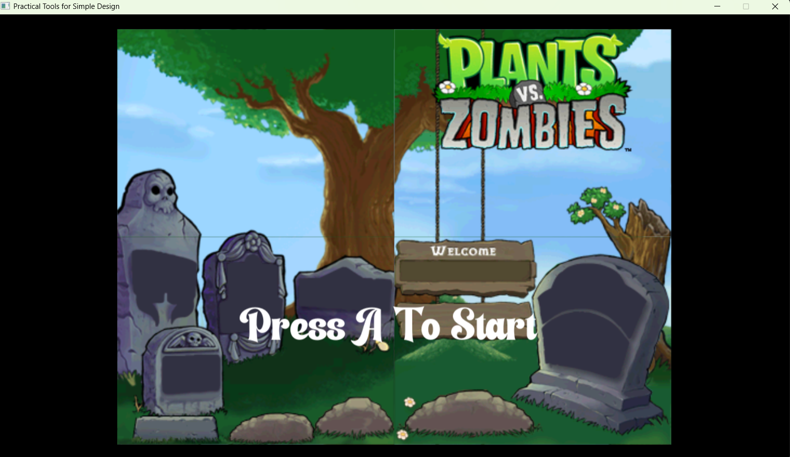
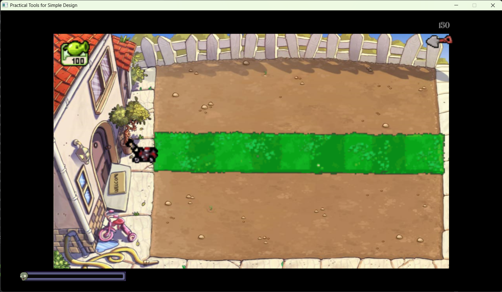
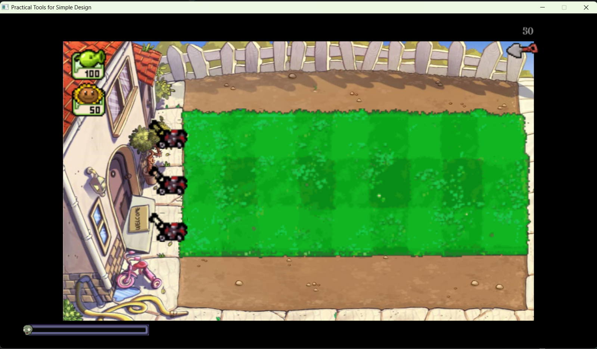
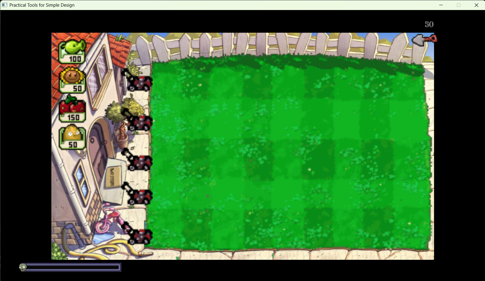
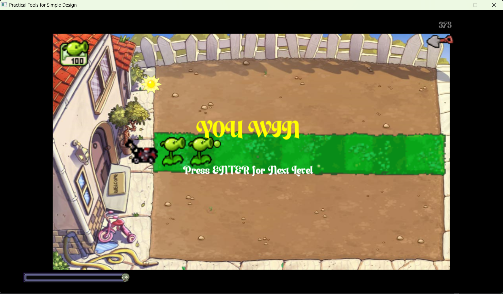
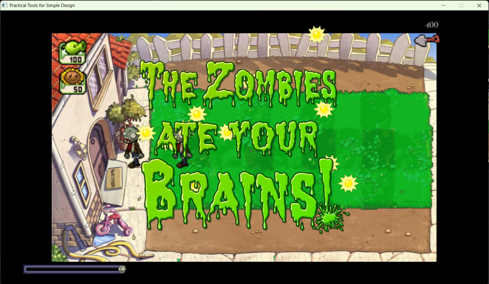
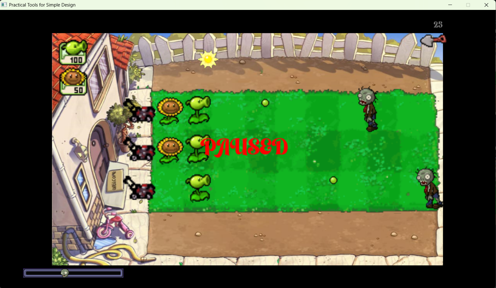
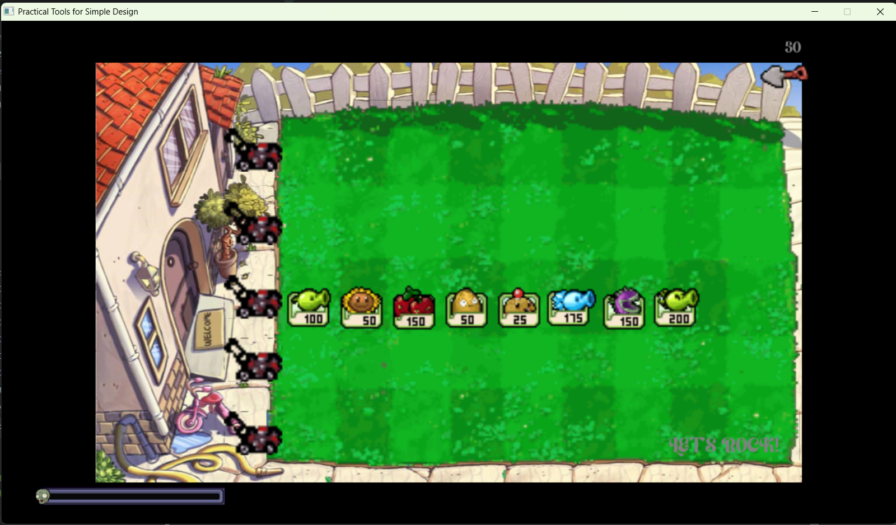

# 2026 OOPL Final Report

## 組別資訊

| 欄位   | 內容                                        |
|------|-------------------------------------------|
| 組別   | T38                                       |
| 組員   | 113820019 張宏愷                             |
| 復刻遊戲 | Plants vs Zombies                         |
| 開發語言 | C++17                                     |
| 框架   | PTSD ( Practical Tools for Simple Design) |
| IDE  | Clion + CMake                             |
| 版本控制 | GitHub                                    |

## 專案簡介
本專案以經典塔防遊戲《植物大戰殭屍》（Plants vs. Zombies）為開發主題，採用物件導向設計方法進行完整遊戲系統建置。
專案內容實作原作冒險模式第 1 至第 10 關之核心遊戲機制，其中第五關特殊小遊戲模式及第十關滾動式傳送帶模式因開發時程與
技術考量未納入本次實作範圍。 

系統採用物件導向程式設計架構，並結合國立臺北科技大學物件導向程式設計課程所使用之 PTSD 框架進行開發，以提升程式
模組化程度、可維護性及擴充性。透過物件導向設計原則，將植物、殭屍、關卡管理、碰撞判定、動畫控制及遊戲狀態管理等功能進行
獨立封裝，降低模組間耦合度並提升程式可讀性。 開發語言採用 C++，並使用 CLion 作為主要整合開發環境（IDE），結合框架提
供之遊戲引擎功能完成遊戲邏輯設計、場景管理、事件處理與圖形介面呈現。 本專案成功重現原作核心玩法，包括植物種植系統、陽光
資源管理、殭屍生成機制、攻擊與碰撞判定、關卡流程控制及勝負條件判定等功能，展現物件導向分析與設計能力，以及大型軟體專案的
模組化開發實務經驗。

### 遊戲簡介
《植物大戰殭屍》是一款2D塔防類遊戲，玩家須種植不同種類的植物以抵禦
不斷向房屋來犯的殭屍，其中植物有負責攻擊的豌豆射手、生產陽光的向日葵等，
殭屍則有頭頂不同物件的殭屍。
### 組別分工

| 工作內容  | 負責人 |
|-------|-----|
| 圖片處理  | 張宏愷 |
| 數值設定  | 張宏愷 |
| 動畫處理  | 張宏愷 |
| 殭屍生成  | 張宏愷 |
| 植物判定  | 張宏愷 |
| 程式架構  | 張宏愷 |

## 遊戲介紹
### 遊戲規則
殭屍會從畫面右方襲來，玩家須花費陽光在5 * 9的草坪上種植植物解決該關所有殭屍。

#### 專案中植物有以下種類 :

| 植物種類             | 圖片                      | 價格  | 效果                                   |
|------------------|-------------------------|-----|--------------------------------------|
| 豌豆射手(Peashooter)|  | 100 | 射出豌豆攻擊殭屍                             |
| 向日葵(Sunflower)   |                         | 50  | 固定時間生產陽光                             |
| 櫻桃炸彈(Cherrybomb) |                         | 150 | 造成3*3爆炸即死傷害                          |
| 堅果牆(Wallnut)     |                         | 50  | 高血量抵禦殭屍                              |
| 土豆地雷(Potatomine) |                     | 25  | 種植一段時間後冒出地面 對殭屍造成1*1即死傷害         |
| 寒冰射手(Snowpea)    |                         | 175 | 射出碗豆可造成緩速效果                          |
| 大嘴花(Chomper)     |                         | 150 | 對前一格殭屍造成即死傷害 冷卻時間時無法攻擊           |
| 雙發射手(Repeater)   |                         | 200 | 一次射出兩發豌豆                             |

#### 專案中殭屍有以下種類

| 殭屍種類           | 圖片                      | 初始出現關卡 | 簡介               |
|------------------|-------------------------|--------|------------------|
| 普通殭屍(Zombie) |  | 1      | 擁有一般血量           |
| 旗幟殭屍(Flag)       |                         | 2      | 擁有較快速度，跟隨一大波殭屍出現 |
| 路障殭屍(ConeHead)   |                         | 3      | 擁有較高血量           |
| 鐵桶殭屍(BuckedHead) ||  7     | 擁有超高血量           |

#### 

### 遊戲畫面

#### 初始畫面

#### 第一關

#### 二、三關

#### 四到十關

#### 勝利畫面

#### 失敗畫面

#### 暫停畫面

#### 選植物畫面

### 按鍵介紹
| 按鍵 |      功能       | 
|:--:|:-------------:|
| A  |     開始遊戲      |
| N  |      跳關       |
| P  | 暫停(按第二下繼續遊戲)  |
| M  |  暫停時按下回到出始畫面  |
| 右鍵 |    取消選取植物     |
| 左鍵 | 點選、放置陽光、植物與鏟子 |

## 程式設計

### 程式架構

```mermaid
classDiagram
%% ------------------------------------
%% 核心與基礎物件 (Core & Base Objects)
%% ------------------------------------
    class GameObject {
        <<base>>
        +SetDrawable()
        +m_Transform
    }

    class Plant {
        <<abstract>>
        -PlantType m_Type
        -int m_HP
    }

    class Zombie {
        <<abstract>>
        -int m_HP
        -float m_Speed
    }

%% 實體繼承結構
    GameObject <|-- Plant
    GameObject <|-- Zombie
    GameObject <|-- Sun
    GameObject <|-- Pea
    GameObject <|-- LawnMower

    Pea <|-- SnowPeaBullet : 繼承

%% ------------------------------------
%% 植物子類別 (Plants Hierarchy)
%% ------------------------------------
    Plant <|-- Peashooter
    Plant <|-- Sunflower
    Plant <|-- Wallnut
    Plant <|-- CherryBomb
    Plant <|-- PotatoMine
    Plant <|-- Repeater
    Plant <|-- SnowPea
    Plant <|-- Chomper

%% ------------------------------------
%% 殭屍子類別 (Zombies Hierarchy)
%% ------------------------------------
    Zombie <|-- NormalZombie
    Zombie <|-- FlagZombie
    Zombie <|-- ConeHeadZombie
    Zombie <|-- BucketHeadZombie

%% ------------------------------------
%% 遊戲系統與管理器 (Systems & Managers)
%% ------------------------------------
    class App
    class SceneManager
    class GameWorld
    class Grid
    class LevelController
    class LevelLoader
    class CombatSystem
    class RenderSystem
    class SunManager
    class PlantFactory
    class Config {
        <<utility>>
    }

    App --> SceneManager : 控制場景切換
    SceneManager --> GameWorld : 載入遊戲世界
    GameWorld *-- Grid : 擁有網格地圖
    GameWorld --> LevelController : 管理關卡進度
    LevelController --> LevelLoader : 讀取關卡資料
    GameWorld --> CombatSystem : 處理碰撞與戰鬥
    GameWorld --> RenderSystem : 處理畫面渲染
    GameWorld --> SunManager : 管理陽光資源
    GameWorld --> PlantFactory : 實例化植物

%% ------------------------------------
%% 使用者介面與種子卡 (UI & Seed Packets)
%% ------------------------------------
    class UIController
    class SeedChooserUI
    class SeedPacketManager
    class SeedPacket

    UIController --> SeedChooserUI : 顯示選卡畫面
    SeedChooserUI --> SeedPacketManager : 管理卡槽
    SeedPacketManager *-- SeedPacket : 包含多張卡片

%% ------------------------------------
%% 介面與策略模式 (Interfaces & Strategies)
%% ------------------------------------
    class GameObserver {
        <<interface>>
        +OnEvent()
    }
    class TargetingStrategy {
        <<interface>>
        +FindTarget()
    }
    class AbilityInterfaces {
        <<interface>>
    }

    GameWorld ..|> GameObserver : 實作觀察者
    Zombie --> TargetingStrategy : 使用索敵策略
    Plant ..|> AbilityInterfaces : 實作特殊能力介面

%% ------------------------------------
%% 列舉與統整 (Enums & Includes)
%% ------------------------------------
    class PlantType {
        <<enumeration>>
    }
    Plant --> PlantType

%% AllPlants 與 AllZombies 主要作為 Header 集成，在邏輯圖中以關聯呈現
    class AllPlants { <<header>> }
    class AllZombies { <<header>> }
```

### 程式技術

以下為本專案中用到的關鍵程式技術盤點

### 1. 核心物件導向設計 (Core OOP)
專案的基石建立在標準的物件導向三大特性上：
* **繼承 (Inheritance)**：利用 `GameObject` 作為所有遊戲實體的底層，再衍生出 `Plant` 與 `Zombie` 兩個抽象基底類別 (Base Class)。這讓底層的渲染系統 (`Renderer`) 只需要知道如何畫出 `GameObject`，而不需要管它是什麼植物。
* **多型 (Polymorphism)**：透過 `virtual` 函數，讓主迴圈可以統一用一個迴圈去呼叫所有植物的更新邏輯，但 `Peashooter` 和 `Sunflower` 會有截然不同的行為表現。
* **介面隔離 (Interfaces)**：導入如 `IAttacker`、`IExplosive` 等介面。這確保了「會爆炸的植物」才需要實作爆炸邏輯，避免了把所有功能都塞進 `Plants` 父類別的臃腫問題。

### 2. 經典設計模式 (Design Patterns)
為了處理複雜的遊戲邏輯與降低模組間的耦合度，本專案運用了多個 GoF 設計模式：
* **狀態機模式 (State Pattern / FSM)**：在 `SceneManager` 中透過 `LevelPhase` 列舉（`MENU`, `DAY_LEVEL`, `WIN` 等）配合 `switch-case` 控制遊戲主流程，確保在暫停或選單畫面時，不會誤觸遊戲內的戰鬥邏輯。
* **觀察者模式 (Observer Pattern)**：`LevelController` 負責判定勝負，並透過 `IGameObserver` 介面將 `LEVEL_WIN` 或 `LEVEL_FAIL` 的事件「廣播」給 `SceneManager`。這徹底解決了互相 `#include` 造成的依賴問題。
* **工廠模式 (Factory Pattern)**：`PlantFactory` 封裝了「產生植物實體」的複雜過程。`SceneManager` 只需要下達 `CreatePlant(PlantType::PEASHOOTER)` 的指令，不需要知道豌豆射手需要設定多少血量或動畫路徑。

### 3. 現代 C++ 特性 (Modern C++)
專案中大量使用了 C++11 以後的現代化標準，大幅提升了程式的安全性與效能：
* **智慧指標 (Smart Pointers)**：全面使用 `std::shared_ptr` 與 `std::make_shared` 來管理遊戲實體 (`m_Plants`, `m_Zombies`) 的記憶體。這意味著當植物被吃掉並從清單中移除時，記憶體會自動釋放，徹底杜絕了傳統 C++ 常見的 Memory Leak (記憶體洩漏) 或是懸空指標 (Dangling Pointer) 問題。
* **標準模板庫 (STL)**：活用 `std::vector` 來管理實體陣列，並使用 `std::map` 來建立關卡設定的對照表 (在 `LevelLoader` 中)，提供了高效的資料查詢與管理。
* **強型別列舉 (Enum Class)**：使用 `enum class PlantType` 而非傳統的 `enum`，避免了命名空間污染與整數隱式轉型的潛在 Bug。

### 使用到 AI/AI Agent 的部分 (沒有用到者，不需要寫這篇)

本專案在開發過程中，導入了 Google Gemini AI 進行輔助開發。主要採用類似「Vibe Coding」的協作模式：由我負責制定核心的技術需求與整體的物件導向程式架構，再交由 AI 負責生成內部的詳細實作程式碼。

然而，實際的執行效果並非完全順利。AI 有時無法精準意會複雜的指令脈絡，或未能完全掌握專案特定底層框架的邏輯，進而給出帶有瑕疵、甚至不符預期的錯誤回應。

因此，整個開發過程仍依賴人工介入。我必須對 AI 產出的結果進行嚴格的程式碼審查（Code Review）、逐步除錯，並針對不完善之處進行手動修改與重構。總結來說，AI 確實能有效加速基礎程式的建構，但開發者自身仍須對系統架構有掌控力與後續的微調能力。

## 結語

### 問題與解決方法

### 1. 動畫資源共享導致的狀態衝突

#### Q : 
嘗試引入 ResourceManager（享元模式 Flyweight Pattern）來讓同種類的植物共用同一份圖片與動畫資源。然而，因為底層框架的 Util::Animation 將「圖片紋理（可共享）」與「播放進度（不可共享的狀態）」綁定在同一個物件裡，導致場上所有的豌豆射手動畫全部同步，甚至互相干擾。

#### A :
果斷移除了 ResourceManager，退回原本的實例化方式。這讓我學到了 -- 享元模式只能用來共享無狀態（Stateless）的資料。在無法修改底層框架的前提下，確保每個實體擁有獨立的動畫狀態才是正確且穩定的做法。

### 2. 遊戲主迴圈過度耦合與勝負判定死角

#### Q : 

原本的 SceneManager 在 Update 迴圈中，每一幀都在向 LevelController 詢問「遊戲贏了嗎？」、「遊戲輸了嗎？」（輪詢 Polling）。這不僅讓 SceneManager 管了太多閒事，還導致在切換關卡時，狀態機發生邏輯死角（例如第二關結束時卡在不贏不輸的局面）。

#### A :

導入了觀察者模式（Observer Pattern）。讓 SceneManager 實作 IGameObserver 介面並成為「觀察者」。現在 LevelController 只需要專心算殭屍數量，一旦勝負已分，就主動發送 Notify 通知場景切換 UI。這大幅降低了系統耦合度，也徹底解決了狀態卡死的問題。

### 3. 滑鼠輸入判定與 UI 殘影問題

#### Q :

在實作種植植物與使用鏟子的拖曳功能時，經常遇到滑鼠按住導致的「幽靈點擊」誤判，或是植物/鏟子的預覽圖在取消選取後仍然殘留在畫面上的「殘影問題」。另外像鏟子按鈕甚至會錯誤地出現在起始選單畫面上。

#### A : 

邏輯層：實作了嚴格的「單次點擊偵測」（記錄前一幀與當前幀的按鍵狀態 currBtn && !s_PrevBtn），攔截了連續觸發的誤判。

渲染層：採用了「視覺絕對覆寫」機制。將 UI 的顯示與否與內部狀態嚴格綁定，狀態不符時強制執行 SetVisible(false)，精準控制每個 UI 元件在不同生命週期（如選單、選卡、遊玩中）的能見度。

### 4. 龐大的「上帝類別」導致程式碼難以維護

#### Q : 

在開發初期，幾乎所有的遊戲邏輯（包含扣血、陽光計算、植物產生、關卡讀取）都塞在 SceneManager 或 GameWorld 裡面，導致程式碼動輒上千行，牽一髮而動全身，要加新功能非常痛苦。

#### A :

物件導向中的單一職責原則（SRP）與依賴反轉，將系統大刀闊斧地拆解：

- 建立 CombatSystem 專門處理碰撞與傷害。

- 建立 SunManager 與 SeedPacketManager 專管資源與冷卻。

- 建立 PlantFactory 封裝實體生成的細節。

- 抽出 LevelLoader 統一管理關卡資料庫。

這樣重構後，各個模組各司其職，專案具備了極高的可讀性與擴充性。

### 自評

| 項次 | 項目                   | 完成 |
|------|------------------------|-------|
| 1    | 這是範例 |  V  |
| 2    | 完成專案權限改為 public |    |
| 3    | 具有 debug mode 的功能  |    |
| 4    | 解決專案上所有 Memory Leak 的問題  |    |
| 5    | 報告中沒有任何錯字，以及沒有任何一項遺漏  |    |
| 6    | 報告至少保持基本的美感，人類可讀  |    |

### 心得

本次的專案開發精驗讓我深刻體會到其困難之處，最一開始將大量程式碼塞在一起的 " God Class " ，進而導致程式碼變得臃腫且難以維護，重構也花了不少心力。且在處理滑鼠殘影時，我更理解了狀態機（State Machine）與渲染生命週期（Render Lifecycle）之間的緊密關聯。這次也嘗試導入了 AI 輔助開發，雖然它能迅速建構基礎邏輯，但面對特定框架的底層限制時，仍高度仰賴開發者對物件導向架構的掌握度來進行除錯與微調。這次專案不僅讓我的軟體工程思維大幅提升，更讓我對未來的遊戲開發之路充滿了信心。

### 貢獻比例
 - 張宏愷 ( 100% )