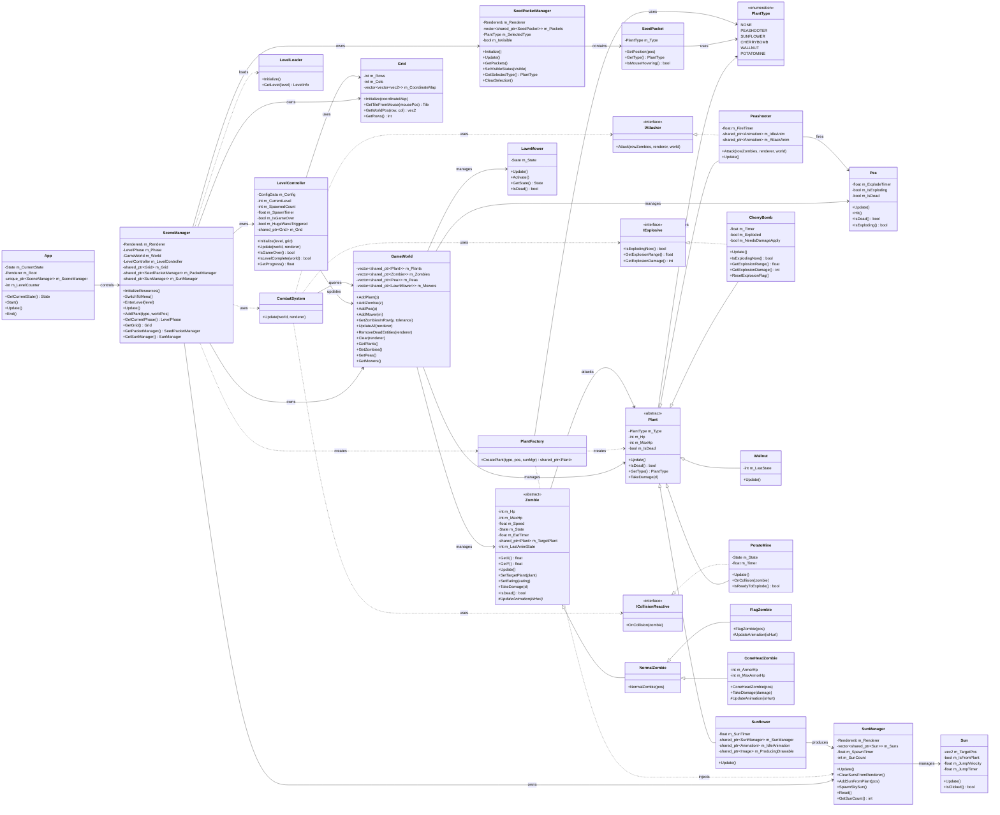

```mermaid
classDiagram
    direction LR

%% =========================
%% Core
%% =========================
    class App {
        -State m_CurrentState
        -Renderer m_Root
        -unique_ptr~SceneManager~ m_SceneManager
        -int m_LevelCounter
        +GetCurrentState() State
        +Start()
        +Update()
        +End()
    }

    class SceneManager {
        -Renderer& m_Renderer
        -LevelPhase m_Phase
        -GameWorld m_World
        -LevelController m_LevelController
        -shared_ptr~Grid~ m_Grid
        -shared_ptr~SeedPacketManager~ m_PacketManager
        -shared_ptr~SunManager~ m_SunManager
        +InitializeResources()
        +SwitchToMenu()
        +EnterLevel(level)
        +Update()
        +AddPlant(type, worldPos)
        +GetCurrentPhase() LevelPhase
        +GetGrid() Grid
        +GetPacketManager() SeedPacketManager
        +GetSunManager() SunManager
    }

    class GameWorld {
        -vector~shared_ptr~Plant~~ m_Plants
        -vector~shared_ptr~Zombie~~ m_Zombies
        -vector~shared_ptr~Pea~~ m_Peas
        -vector~shared_ptr~LawnMower~~ m_Mowers
        +AddPlant(p)
        +AddZombie(z)
        +AddPea(p)
        +AddMower(m)
        +GetZombiesInRow(y, tolerance)
        +UpdateAll(renderer)
        +RemoveDeadEntities(renderer)
        +Clear(renderer)
        +GetPlants()
        +GetZombies()
        +GetPeas()
        +GetMowers()
    }

    class LevelController {
        -ConfigData m_Config
        -int m_CurrentLevel
        -int m_SpawnedCount
        -float m_SpawnTimer
        -bool m_IsGameOver
        -bool m_HugeWaveTriggered
        -shared_ptr~Grid~ m_Grid
        +Initialize(level, grid)
        +Update(world, renderer)
        +IsGameOver() bool
        +IsLevelComplete(world) bool
        +GetProgress() float
    }

    class Grid {
        -int m_Rows
        -int m_Cols
        -vector~vector~vec2~~ m_CoordinateMap
        +Initialize(coordinateMap)
        +GetTileFromMouse(mousePos) Tile
        +GetWorldPos(row, col) vec2
        +GetRows() int
    }

    class LevelLoader {
        +Initialize()
        +GetLevel(level) LevelInfo
    }

    class CombatSystem {
        +Update(world, renderer)
    }

    class PlantFactory {
        +CreatePlant(type, pos, sunMgr) shared_ptr~Plant~
    }

    class PlantType {
        <<enumeration>>
        NONE
        PEASHOOTER
        SUNFLOWER
        CHERRYBOMB
        WALLNUT
        POTATOMINE
    }

%% =========================
%% Ability Interfaces
%% =========================
    class IAttacker {
        <<interface>>
        +Attack(rowZombies, renderer, world)
    }

    class IExplosive {
        <<interface>>
        +IsExplodingNow() bool
        +GetExplosionRange() float
        +GetExplosionDamage() int
    }

    class ICollisionReactive {
        <<interface>>
        +OnCollision(zombie)
    }

%% =========================
%% Plant System
%% =========================
    class Plant {
        <<abstract>>
        -PlantType m_Type
        -int m_Hp
        -int m_MaxHp
        -bool m_IsDead
        +Update()*
        +IsDead() bool
        +GetType() PlantType
        +TakeDamage(d)
    }

    class Peashooter {
        -float m_FireTimer
        -shared_ptr~Animation~ m_IdleAnim
        -shared_ptr~Animation~ m_AttackAnim
        +Attack(rowZombies, renderer, world)
        +Update()
    }

    class Sunflower {
        -float m_SunTimer
        -shared_ptr~SunManager~ m_SunManager
        -shared_ptr~Animation~ m_IdleAnimation
        -shared_ptr~Image~ m_ProducingDrawable
        +Update()
    }

    class CherryBomb {
        -float m_Timer
        -bool m_Exploded
        -bool m_NeedsDamageApply
        +Update()
        +IsExplodingNow() bool
        +GetExplosionRange() float
        +GetExplosionDamage() int
        +ResetExplosionFlag()
    }

    class Wallnut {
        -int m_LastState
        +Update()
    }

    class PotatoMine {
        -State m_State
        -float m_Timer
        +Update()
        +OnCollision(zombie)
        +IsReadyToExplode() bool
    }

%% =========================
%% Zombie System
%% =========================
    class Zombie {
        <<abstract>>
        -int m_Hp
        -int m_MaxHp
        -float m_Speed
        -State m_State
        -float m_EatTimer
        -shared_ptr~Plant~ m_TargetPlant
        -int m_LastAnimState
        +GetX() float
        +GetY() float
        +Update()
        +SetTargetPlant(plant)
        +SetEating(eating)
        +TakeDamage(d)
        +IsDead() bool
        #UpdateAnimation(isHurt)*
    }

    class NormalZombie {
        +NormalZombie(pos)
    }

    class FlagZombie {
        +FlagZombie(pos)
        #UpdateAnimation(isHurt)
    }

    class ConeHeadZombie {
        -int m_ArmorHp
        -int m_MaxArmorHp
        +ConeHeadZombie(pos)
        +TakeDamage(damage)
        #UpdateAnimation(isHurt)
    }

%% =========================
%% Other Entities / UI
%% =========================
    class Pea {
        -float m_ExplodeTimer
        -bool m_IsExploding
        -bool m_IsDead
        +Update()
        +Hit()
        +IsDead() bool
        +IsExploding() bool
    }

    class LawnMower {
        -State m_State
        +Update()
        +Activate()
        +GetState() State
        +IsDead() bool
    }

    class SeedPacket {
        -PlantType m_Type
        +SetPosition(pos)
        +GetType() PlantType
        +IsMouseHovering() bool
    }

    class SeedPacketManager {
        -Renderer& m_Renderer
        -vector~shared_ptr~SeedPacket~~ m_Packets
        -PlantType m_SelectedType
        -bool m_IsVisible
        +Initialize()
        +Update()
        +GetPackets()
        +SetVisibleStatus(visible)
        +GetSelectedType() PlantType
        +ClearSelection()
    }

    class Sun {
        -vec2 m_TargetPos
        -bool m_IsFromPlant
        -float m_JumpVelocity
        -float m_JumpTimer
        +Update()
        +IsClicked() bool
    }

    class SunManager {
        -Renderer& m_Renderer
        -vector~shared_ptr~Sun~~ m_Suns
        -float m_SpawnTimer
        -int m_SunCount
        +Update()
        +ClearSunsFromRenderer()
        +AddSunFromPlant(pos)
        +SpawnSkySun()
        +Reset()
        +GetSunCount() int
    }

%% =========================
%% Inheritance / Interfaces
%% =========================
    Plant <|-- Peashooter
    Plant <|-- Sunflower
    Plant <|-- CherryBomb
    Plant <|-- Wallnut
    Plant <|-- PotatoMine

    Zombie <|-- NormalZombie
    NormalZombie <|-- FlagZombie
    NormalZombie <|-- ConeHeadZombie

    IAttacker <|.. Peashooter
    IExplosive <|.. CherryBomb
    ICollisionReactive <|.. PotatoMine

%% =========================
%% Associations
%% =========================
    App --> SceneManager : controls

    SceneManager --> GameWorld : owns
    SceneManager --> LevelController : owns
    SceneManager --> Grid : owns
    SceneManager --> SeedPacketManager : owns
    SceneManager --> SunManager : owns
    SceneManager ..> CombatSystem : uses
    SceneManager ..> PlantFactory : creates
    SceneManager ..> LevelLoader : loads

    LevelController --> GameWorld : updates
    LevelController --> Grid : uses

    GameWorld --> Plant : manages
    GameWorld --> Zombie : manages
    GameWorld --> Pea : manages
    GameWorld --> LawnMower : manages

    CombatSystem --> GameWorld : queries
    CombatSystem ..> IAttacker : uses
    CombatSystem ..> IExplosive : uses
    CombatSystem ..> ICollisionReactive : uses

    Plant --> PlantType : uses
    SeedPacket --> PlantType : uses
    SeedPacketManager --> SeedPacket : contains
    PlantFactory --> PlantType : uses
    PlantFactory ..> Plant : creates
    PlantFactory ..> SunManager : injects

    Peashooter --> Pea : fires
    Sunflower --> SunManager : produces
    SunManager --> Sun : manages
    Zombie --> Plant : attacks
```