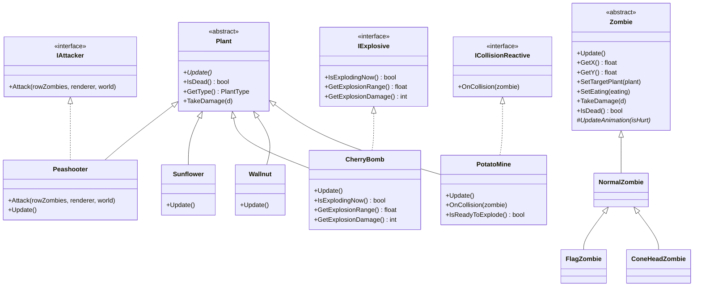

```mermaid
classDiagram
    direction TB

    class Plant {
        <<abstract>>
        +Update()*
        +IsDead() bool
        +GetType() PlantType
        +TakeDamage(d)
    }

    class Zombie {
        <<abstract>>
        +Update()
        +GetX() float
        +GetY() float
        +SetTargetPlant(plant)
        +SetEating(eating)
        +TakeDamage(d)
        +IsDead() bool
        #UpdateAnimation(isHurt)*
    }

    class IAttacker {
        <<interface>>
        +Attack(rowZombies, renderer, world)
    }

    class IExplosive {
        <<interface>>
        +IsExplodingNow() bool
        +GetExplosionRange() float
        +GetExplosionDamage() int
    }

    class ICollisionReactive {
        <<interface>>
        +OnCollision(zombie)
    }

    class Peashooter {
        +Attack(rowZombies, renderer, world)
        +Update()
    }

    class Sunflower {
        +Update()
    }

    class CherryBomb {
        +Update()
        +IsExplodingNow() bool
        +GetExplosionRange() float
        +GetExplosionDamage() int
    }

    class Wallnut {
        +Update()
    }

    class PotatoMine {
        +Update()
        +OnCollision(zombie)
        +IsReadyToExplode() bool
    }

    class NormalZombie
    class FlagZombie
    class ConeHeadZombie

    Plant <|-- Peashooter
    Plant <|-- Sunflower
    Plant <|-- CherryBomb
    Plant <|-- Wallnut
    Plant <|-- PotatoMine

    Zombie <|-- NormalZombie
    NormalZombie <|-- FlagZombie
    NormalZombie <|-- ConeHeadZombie

    IAttacker <|.. Peashooter
    IExplosive <|.. CherryBomb
    ICollisionReactive <|.. PotatoMine
```